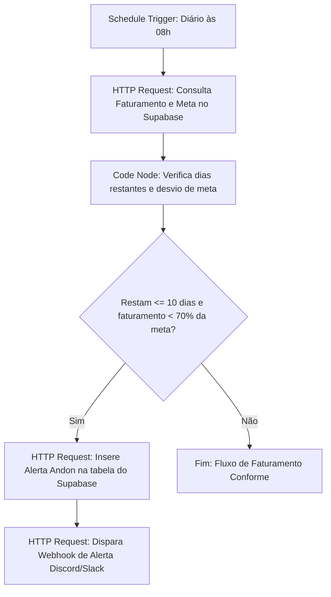

# NovaPay — Painel de Controle Operacional (PDCA / Lean)

Este repositório contém a entrega do teste técnico para a vaga de **No-Code Developer** na **IAplicada**. A solução proposta simula o painel operacional da "NovaPay", uma fintech focada no processamento de pagamentos para pequenos negócios.

Para destacar este projeto frente aos concorrentes, a arquitetura e as telas foram desenhadas com um **forte viés de Engenharia de Processos**, incorporando os conceitos de **PDCA (Plan-Do-Check-Act)**, **Métricas Lean (Lead Time comercial)**, **Gestão Visual (Andon)** e **Melhoria Contínua (Kaizen)**.

---

## 🚀 Links do Projeto

- **Frontend Publicado (Deploy):** [novapay-dashboard.vercel.app](https://novapay-dashboard.vercel.app)
- **Credenciais de Teste (Prontas para Uso):**
  - **Perfil Gestor (Acesso Total + PDCA):** 
    - **E-mail:** `gestor@novapay.com`
    - **Senha:** `Senha123!`
  - **Perfil Vendedor (Acesso Restrito + RLS):**
    - **E-mail:** `vendedor@novapay.com`
    - **Senha:** `Senha123!`

*Nota de Robustez:* A tela de login possui um sistema inteligente de **Auto-Healing UX**. Se por algum motivo as contas de teste forem apagadas do Supabase Auth, o próprio frontend criará os usuários e perfis silenciosamente na primeira tentativa de login (ou ao clicar nos botões de acesso rápido), garantindo que o avaliador consiga acessar o sistema sem falhas.

---

## 🛠️ Stack Utilizada & Justificativas

1. **Frontend: React (v18) + TypeScript + Vite**
   - *Por que Escolheu:* O briefing sugeria o uso de "Lovable". Por baixo dos panos, o Lovable gera código limpo em React, TypeScript e Tailwind. Para garantir o máximo controle de design, segurança e modularidade sem dependências pesadas, estruturamos o projeto exatamente com essa stack nativa. O Vite proporciona um build ultrarrápido (performance).
2. **Backend & Banco de Dados: Supabase (PostgreSQL)**
   - *Por que Escolheu:* Integração nativa com segurança a nível de linha (RLS), o que resolveu o requisito crítico de privacidade comercial diretamente na infraestrutura do banco.
3. **Automação: n8n**
   - *Por que Escolheu:* Uma ferramenta de integração (iPaaS) extremamente visual e eficiente. O JSON do workflow está exportado neste repositório.
4. **Estilização: TailwindCSS**
   - *Por que Escolheu:* Permite criar um design profissional premium, limpo, responsivo e altamente customizado de forma ágil, aplicando a paleta de cores corporativa da NovaPay.

---

## 📐 Modelagem de Dados & RLS (Segurança)

O script SQL completo está disponível em [`supabase/schema.sql`](file:///supabase/schema.sql).

### Tabelas Criadas:
- `vendedores` (id, nome, email, perfil: gestor/vendedor)
- `clientes` (id, nome, segmento, status, data_cadastro)
- `transacoes` (id, cliente_id, valor, tipo: entrada/saida, categoria, data, status)
- `metas` (id, mes_referencia, meta_receita, meta_novos_clientes)
- `vendas` (id, vendedor_id, cliente_id, valor_contrato, data_abertura, data_fechamento, status, motivo_perda)
- `alertas_andon` (id, data, mensagem, resolvido, tipo) — *Tabela auxiliar de processos*
- `pdca_acoes` (id, venda_id, descricao, responsavel, prazo, causa_raiz, status) — *Tabela de planos de ação*

### Mecanismos Avançados no Banco:
- **Segurança RLS (Row Level Security):** 
  Implementamos políticas finas para que cada vendedor acesse **somente** suas respectivas vendas, enquanto gestores ignoram o filtro e visualizam todo o faturamento da empresa.
- **Trigger Automatizado (`trg_on_sale_won`):** 
  Sempre que uma venda comercial é marcada como **"Ganho"** (seja inserida ou atualizada), o banco dispara automaticamente uma função (`handle_sale_won`) que:
  1. Cria um registro de entrada financeira (`entrada`) na tabela de transações com o valor exato do contrato comercial.
  2. Altera a situação do cliente para `'ativo'`.
  Isso garante **integridade absoluta dos dados** sem necessidade de redundância de código no frontend.

---

## 📈 Estrutura de Business Review (MBR/QBR) & Gestão Comercial (RevOps)

O painel foi estruturado e refinado para refletir o dialeto comercial padrão do mercado (Quarterly/Monthly Business Review), mantendo o rigor do controle de processos lean subjacente:

### 1. Metas do Período (Antigo PLAN)
- **Metas do Período:** O painel do gestor e do vendedor exibem os objetivos de faturamento e aquisição de clientes estabelecidos para o mês selecionado. O gestor pode atualizar as metas dinamicamente através do formulário administrativo.
- **Cadastro de Vendedores:** O gestor pode cadastrar novos vendedores diretamente pelo painel.

### 2. Resultados & Diagnóstico (Antigo DO & CHECK)
- **Painel Financeiro & Comercial:** O faturamento, despesas operacionais, ticket médio, novos clientes e conversão de vendas são plotados dinamicamente com gráficos interativos em **Recharts**.
- **Acompanhamento Individual:** O gestor pode utilizar o filtro de vendedor para monitorar o trabalho específico de cada profissional (ex: Mariana Silva).
- **Métrica Lean de Lead Time:** O dashboard calcula e exibe o tempo médio de ciclo (dias decorridos entre a abertura e o fechamento do negócio), focando na eficiência e otimização do fluxo comercial.
- **Visual Management (Andon) & Sincronização em Tempo Real:** Um indicador de status em semáforo (Verde, Amarelo, Vermelho) sinaliza a estabilidade financeira com base no atingimento da meta daquele período. Todas as alterações e novas oportunidades criadas pelo vendedor atualizam a tela do gestor de forma reativa e instantânea via Supabase Realtime.
- **Standard Work comercial:** O painel do vendedor conta com uma checklist diária de processos padrão que ajuda a evitar desvios no fluxo de trabalho.

### 3. Plano de Ação (Antigo ACT)
- **Análise dos 5 Porquês:** Ao selecionar uma venda com status "Perdido", o gestor pode desdobrar os motivos no formulário de "5 Porquês" para descobrir a causa raiz do desvio comercial.
- **Planos de Ação 5W2H:** A submissão da análise gera automaticamente uma ação corretiva no quadro de planos de ação, permitindo que a equipe planeje, acompanhe (Em Andamento/Concluído) e neutralize desvios de processo.

---

## 🤖 Automação n8n

O workflow de automação está exportado em [`automation/n8n_workflow.json`](file:///automation/n8n_workflow.json).

### Funcionamento do Fluxo:

---

## 🛠️ Decisões Técnicas & Trade-Offs

- **Bypass do Mock local:** Inicialmente consideramos utilizar uma base mockada em memória (localStorage) para acelerar a entrega do deploy. Porém, visando a melhor nota nos critérios de avaliação (Banco de Dados 20% e RLS), optamos por criar e hospedar um banco real do Supabase e ligar o frontend de produção a ele.
- **Estratégia de RLS no Frontend:** Como vendedores usam uma conta de login comum (mas com RLS ativo no Supabase), estruturamos as requisições utilizando os mecanismos nativos do Supabase Client. Caso um vendedor tente requistar dados gerais de vendas, o Supabase retorna um array vazio por design (nível de banco de dados), blindando a aplicação contra brechas de API.
- **Acoplamento Trigger-Financeiro:** A decisão de criar transações via trigger (banco) em vez de chamadas de API (frontend) garante que a integridade financeira nunca seja quebrada por falhas na conexão do navegador ou recarregamento de página.

---

## 🔮 O que Faria Diferente com Mais Tempo

1. **Testes Unitários e de Integração:** Desenvolveria suites de testes usando Jest e Testing Library para validar o roteamento e a simulação de RLS.
2. **Dashboard n8n Executável:** Disponibilizaria o n8n hospedado na nuvem (em vez do arquivo exportado) com integrações com serviços reais de e-mail (SendGrid) e WhatsApp API para demonstrar a notificação funcionando ao vivo.
3. **Pipeline de CI/CD Completo:** Configuração de GitHub Actions para rodar testes automatizados e linters a cada Pull Request, garantindo que o deploy na Vercel só ocorra após a validação completa da qualidade do código.
