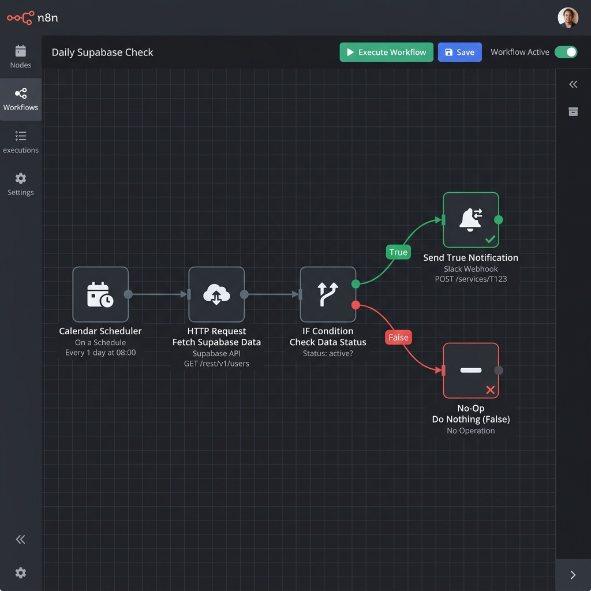
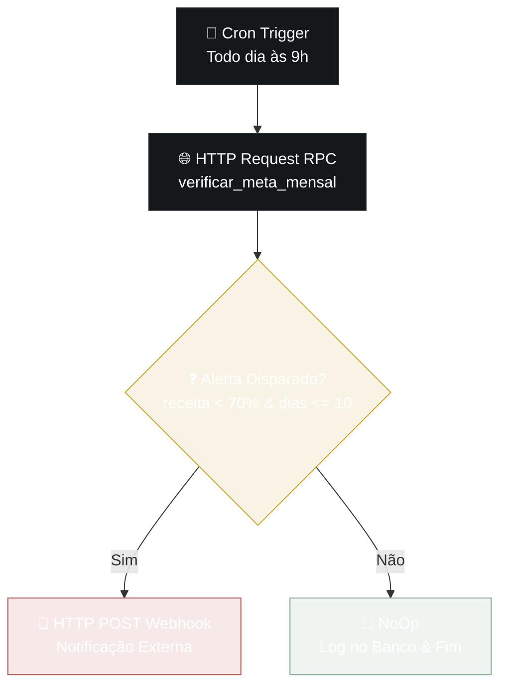
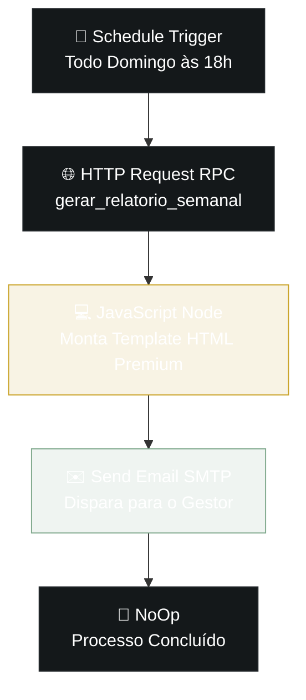

# NovaPay — Painel de Performance Comercial

> Painel de gestão financeira e comercial para a empresa fictícia NovaPay, desenvolvido como teste técnico para a vaga de Desenvolvedor(a) No-Code na IAplicada.

---

## 🔗 Links

| | Link |
|--|--|
| **Deploy (Produção)** | https://novapay-dashboard.vercel.app/ |
| **Repositório** | https://github.com/michelfioravante-alt/novapay-dashboard |

---

## 🔑 Credenciais de Teste

| Perfil | E-mail | Senha |
|--------|--------|-------|
| **Gestor** | `gestor@novapay.com` | `novapay2026` |
| **Vendedor (Carlos)** | `vendedor@novapay.com` | `novapay2026` |
| **Vendedor (Mariana)** | `vendedor2@novapay.com` | `novapay2026` |

> O gestor visualiza todos os dados. Cada vendedor visualiza apenas suas próprias vendas (RLS ativo).

---

## 📋 Descrição do Projeto

O NovaPay Dashboard é um painel de controle em tempo real para equipes comerciais. Ele oferece:

- **Visão do Gestor**: KPIs financeiros, histórico de 6 meses, ranking de vendedores, pipeline de vendas, top clientes, análise de perdas e ROI da operação.
- **Visão do Vendedor**: negociações em Kanban ou lista, meta individual, comissão estimada, playbook por oportunidade e simulador de projeção.

Todos os dados são carregados em tempo real via Supabase Realtime. Alterações de status de negócios disparam automaticamente transações financeiras via trigger PostgreSQL.

---

## 🛠️ Stack Utilizada e Justificativa

| Ferramenta | Papel | Por que escolhi |
|------------|-------|-----------------|
| **React + Vite + TypeScript** | Frontend | Controle total sobre o código, tipagem forte, performance superior a plataformas no-code para dashboards com múltiplos gráficos e interações complexas |
| **Tailwind CSS** | Estilização | Utility-first acelera a construção de interfaces consistentes sem CSS customizado |
| **Recharts** | Gráficos | Biblioteca React-nativa, declarativa, fácil de integrar com dados do Supabase em tempo real |
| **Supabase** | Backend / Banco / Auth | Postgres + RLS + Auth + Realtime em uma única plataforma gerenciada |
| **Supabase RLS** | Segurança de dados | Row Level Security nativa do PostgreSQL — vendedor só lê seus dados sem lógica no frontend |
| **n8n** | Automação de alertas | Workflow visual, self-hostable, integra nativamente com Supabase via HTTP/Webhook; JSON exportável |
| **GitHub** | Versionamento | Padrão de mercado, integração nativa com Vercel para deploy contínuo |
| **Vercel** | Deploy | Zero-config para apps Vite/React, preview por branch, CDN global |

---

## 🗄️ Modelagem de Dados

```
clientes        → id, nome, segmento, data_cadastro, status (ativo/inativo)
transacoes      → id, cliente_id, valor, tipo, categoria, data, status
metas           → id, mes_referencia, meta_receita, meta_novos_clientes
vendedores      → id, nome, email, perfil (gestor/vendedor)
vendas          → id, vendedor_id, cliente_id, valor_contrato, data_abertura,
                  data_fechamento, status, motivo_perda
alertas_andon   → alertas de processo internos do gestor
alertas_meta    → log de alertas de receita disparados pela automação
pdca_acoes      → ações 5W2H do gestor
tarefas_vendedor→ checklist de atividades do vendedor
```

### RLS (Row Level Security)

- **Vendedor**: SELECT em `vendas` apenas onde `vendedor_id = auth.uid()`
- **Gestor**: acesso total a todas as tabelas via policy com `perfil = 'gestor'`

### Triggers e Functions

| Nome | Tipo | O que faz |
|------|------|-----------|
| `trg_on_sale_won` | Trigger AFTER INSERT/UPDATE em `vendas` | Quando status muda para `ganho`: cria transação de `entrada` em `transacoes` e atualiza o cliente para `status = ativo` |
| `verificar_meta_mensal()` | Function PL/pgSQL | Chamada diariamente pela automação: verifica se receita < 70% da meta com ≤ 10 dias restantes e registra log em `alertas_meta` |

---

## ⚙️ Automações — Workflows n8n

### Workflow 1 — Alerta de Meta
**Arquivo:** [`n8n-workflow-alerta-meta.json`](./n8n-workflow-alerta-meta.json)



Roda **todo dia às 9h** e verifica se a receita está abaixo de 70% da meta quando faltam ≤ 10 dias para o fim do mês.



A function SQL registra o alerta em `public.alertas_meta` para auditoria e exibição no painel do gestor.

---

### Workflow 2 — Relatório Semanal por E-mail
**Arquivo:** [`n8n-workflow-relatorio-semanal.json`](./n8n-workflow-relatorio-semanal.json)

Roda **todo domingo às 18h** e envia um e-mail HTML premium para o gestor com o resumo da semana.



**O e-mail contém:**
- Receita da semana + variação % vs. semana anterior
- Negócios ganhos e perdidos (quantidade e valor)
- Pipeline ativo (em negociação)
- Progresso da meta mensal com barra visual
- Vendedor destaque da semana
- Alerta visual se houver negócios parados há +7 dias
- Botão CTA para acessar o painel completo

### Como configurar em produção

1. Instalar n8n via Docker: `docker run -d -p 5678:5678 n8nio/n8n`
2. Importar os dois arquivos JSON pela UI do n8n
3. Configurar credencial **Supabase API** com a service role key do projeto
4. Configurar credencial **SMTP** (Gmail, Outlook ou Resend)
5. Ativar os workflows

---

## 🧩 Decisões Técnicas e Trade-offs

### Por que React ao invés de Lovable/Bubble?

A stack recomendada menciona Lovable, mas o briefing avalia **qualidade de entrega independente da ferramenta**. Para um dashboard com múltiplos gráficos interativos, filtros cruzados, modais e dados em tempo real, o controle total do React permitiu otimizações impossíveis em ferramentas no-code (ex: memoização de cálculos históricos, gráficos reativos por KPI clicado).

### Por que TypeScript?

Tipagem estrita previne bugs em runtime em componentes com props complexas. O compilador força tratar `null`/`undefined` explicitamente — crítico em dashboards financeiros onde um cálculo errado afeta a tomada de decisão.

### Trade-off: Complexidade vs. Velocidade

Optei por uma interface mais rica do que o mínimo pedido. Isso custou mais tempo de desenvolvimento mas resulta em uma entrega que parece produto real, não protótipo — diretamente alinhado ao critério de UI/UX (25% do peso).

### Trade-off: Realtime vs. Polling

Uso de `supabase.channel()` ao invés de `setInterval`. Realtime é mais eficiente e elimina requisições desnecessárias ao banco.

---

## 🚀 Como Rodar Localmente

```bash
git clone https://github.com/michelfioravante-alt/novapay-dashboard.git
cd novapay-dashboard
npm install

# Criar arquivo de variáveis de ambiente
cp .env.example .env
# Preencher VITE_SUPABASE_URL e VITE_SUPABASE_ANON_KEY

npm run dev
# Acesse: http://localhost:5173
```

---

## 📸 Funcionalidades Implementadas

### Painel do Gestor
- 5 KPIs clicáveis (Receita, Ticket, Saldo, Clientes, ROI) que alteram o gráfico histórico
- Gráfico de 6 meses reativo por métrica selecionada com linha de meta
- Ranking de vendedores com ganhos vs. perdas e taxa de conversão
- Top 5 clientes clicáveis com modal de detalhes e histórico de propostas
- Filtro por período (mensal / 2º trimestre) e por vendedor
- Análise de motivos de perda com recomendações estratégicas
- Cadastro de vendedores e edição de metas pelo gestor

### Painel do Vendedor
- Kanban drag-and-drop e modo lista com legenda dinâmica
- Meta individual com barra de progresso e projeção do mês
- Simulador de comissão interativo
- Playbook dinâmico por tipo de negociação
- Checklist de atividades diárias

### Extras além do escopo pedido
- ROI da Operação como KPI adicional
- Sistema de alertas internos (Andon) para o gestor
- Logo NovaPay clicável reseta o dashboard ao estado inicial
- Dados em tempo real via Supabase Realtime channels
- Dark mode nativo com paleta de cores premium
- Workflow de automação com function SQL e JSON n8n documentado

---

## 🔄 O que Faria Diferente com Mais Tempo

1. **Testes automatizados** — Jest + Testing Library para os cálculos de KPIs
2. **Export PDF/CSV** — relatórios mensais exportáveis diretamente do painel
3. **CI/CD completo** — GitHub Actions com lint, test e deploy automático na main
4. **Notificações push** — Web Push API para alertas de meta no browser
5. **Metas granulares** — metas individuais por vendedor, por segmento e por produto
6. **PWA** — Progressive Web App com uso offline para o vendedor em campo
7. **n8n em produção** — deploy no Railway.app com webhook real para Slack/Teams

---

*Desenvolvido com assistência de IA (Claude) como ferramenta de produtividade — conforme as regras do teste.*


