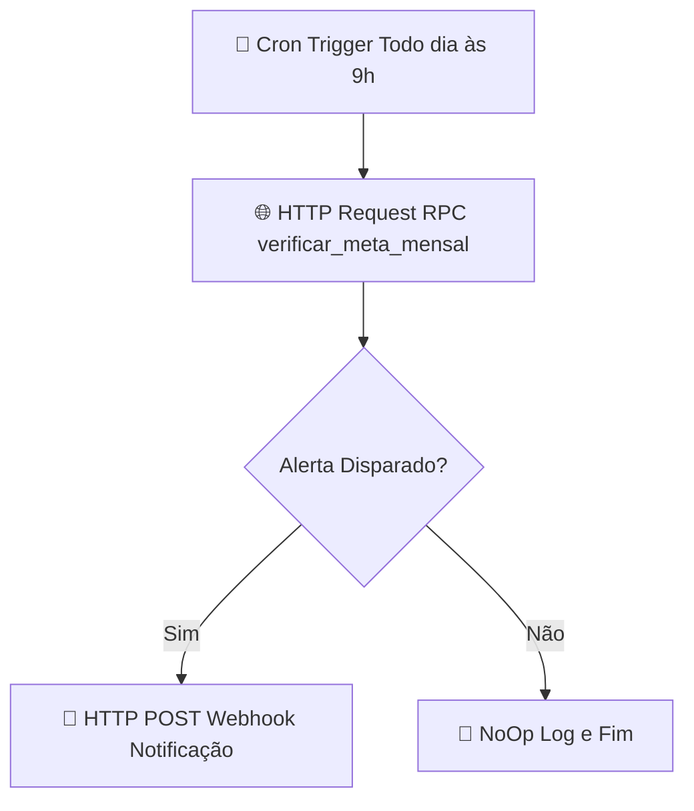

# 📊 NovaPay — Dashboard de Performance Comercial

**Painel de gestão financeira e comercial em tempo real com automação de alertas via n8n e controle de acesso granular por perfil.**

---

## 📌 Contexto e Problema

Equipes comerciais frequentemente não têm visibilidade em tempo real sobre sua performance financeira. Indicadores de meta, comissões e pipeline são consultados em planilhas desatualizadas ou dependem de relatórios manuais. Desvios de faturamento só são percebidos quando já é tarde para a correção de rota.

Este projeto demonstra como integrar **interface de decisão**, **regras de negócio no banco de dados** e **automação externa (n8n)** em uma única solução coesa.

---

## 💡 Solução Desenvolvida

**Visão do Gestor:**
KPIs financeiros consolidados, histórico de 6 meses, ranking de desempenho da equipe, pipeline de vendas, análise de perdas e ROI da operação.

**Visão do Vendedor:**
Negociações em Kanban ou lista, meta individual com progresso visual, comissão estimada em tempo real, playbook de abordagem por oportunidade e simulador de projeção.

---

## ⚙️ Automações e Lógica de Negócio

**Triggers PostgreSQL (Supabase)**
Alterações de status no pipeline de vendas disparam automaticamente lançamentos financeiros em `transacoes`, sem intervenção manual ou lógica no frontend:
- `trg_on_sale_won`: quando uma venda é marcada como `ganho`, cria uma entrada financeira e atualiza o status do cliente para `ativo`.

**Workflows n8n (exportados neste repositório)**

*Workflow 1 — Alerta de Meta:*
Roda diàriamente via Cron. Chama uma Function PL/pgSQL via RPC que verifica se a receita está abaixo de 70% da meta com ≤10 dias restantes no mês. Se confirmado, registra um alerta no painel do gestor e dispara notificação externa via Webhook.

```mermaid
graph TD
    A[📅 Cron Trigger Todo dia às 9h] --> B[🌐 HTTP Request RPC verificar_meta_mensal]
    B --> C{Alerta Disparado?}
    C -- Sim --> D[📢 HTTP POST Webhook Notificação]
    C -- Não --> E[💾 NoOp Log e Fim]
```

---

## 🔒 Segurança e Controle de Acesso (RLS)

O isolamento de dados entre perfis é implementado exclusivamente no banco de dados via Row Level Security do PostgreSQL:

| Recurso | Vendedor | Gestor |
|:--------|:---------|:-------|
| Clientes | Apenas carteira própria | Acesso total |
| Vendas e Propostas | Apenas registros próprios | Funil completo |
| Transações Financeiras | Sem acesso | Acesso total |
| Alertas e Metas | Própria meta | Visão consolidada |

---

## 🔑 Credenciais de Demonstração

| Perfil | E-mail | Senha |
|:-------|:-------|:------|
| **Gestor** | `gestor@novapay.com` | `novapay2026` |
| **Vendedor (Carlos)** | `vendedor@novapay.com` | `novapay2026` |
| **Vendedor (Mariana)** | `vendedor2@novapay.com` | `novapay2026` |

---

## 🛠️ Stack Completa

| Camada | Tecnologia |
|:-------|:-----------|
| UI | React + Vite + TypeScript |
| Estilização | Tailwind CSS |
| Gráficos | Recharts |
| Backend / Banco | Supabase (PostgreSQL + Auth + RLS + Triggers) |
| Automação | n8n (workflows exportáveis em JSON) |
| Deploy | Vercel |

---

**Michel Fioravante** — Especialista em Automação e Processos

